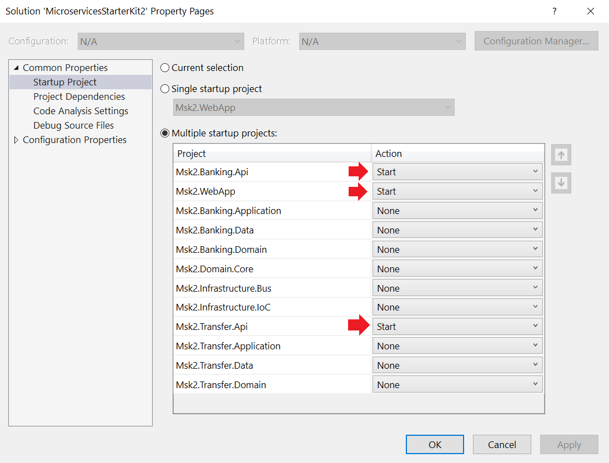

# microservices-starter-kit-2

### Download and Install Erlang

http://erlang.org/download/otp_win64_23.0.exe

### Downlaod and Install Rabbit MQ

https://www.rabbitmq.com/install-windows.html#installer or

https://github.com/rabbitmq/rabbitmq-server/releases/download/v3.8.8/rabbitmq-server-3.8.8.exe

### Enable RabbitMQ Admin

Start Menu _RabbitMQ Command Prompt_

`C:\Program Files\RabbitMQ Server\rabbitmq_server-3.8.8\sbin>rabbitmq-plugins enable rabbitmq_management`

### Rabbit MQ URL

http://localhost:15672/

username: guest, password: guest

---

### Install SQL Server Locally

Update connection strings inside two `appsettings.json` files accordingly.

---

### Start Multiple Project

